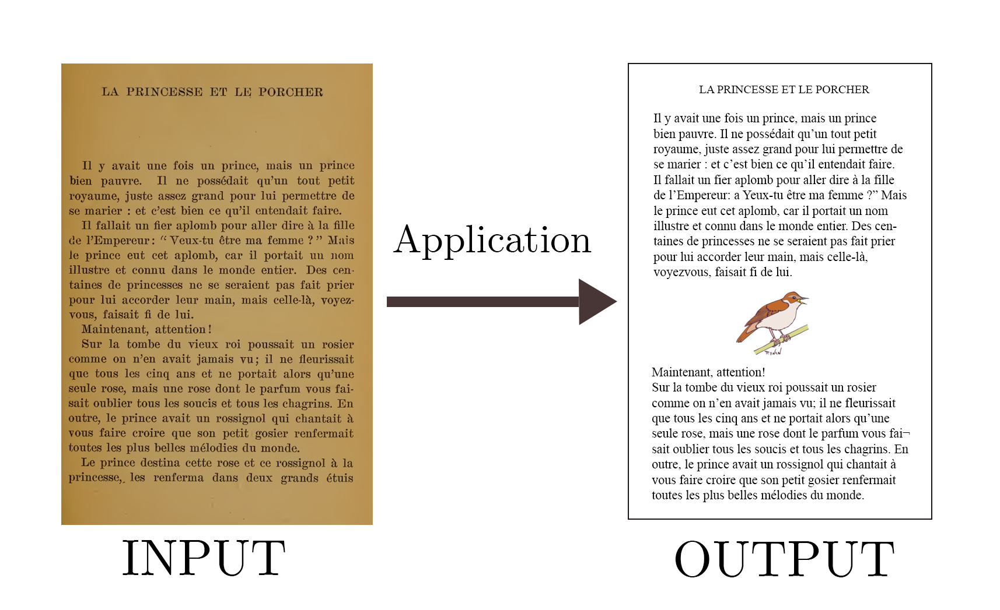

# Document illustrator

  

## Datasets
L'objectif est de couvrir au maximum l'espace sémantique, pour cela on utilise les datasets:
- cocodataset2017 : pour des images photos du quotidien 
- wikiart : pour des images d'illustrations

On applique le traitement suivant sur wikiart: comme le dataset fait 30Go, on l'allège considérablement en ne conservant que les classes : 
- Romanticism
- Symbolism
- Impressionism 
- Post_Impressionism
- High_Renaissance
- Baroque 
- Realism

Et sur chacunes de ces classes on applique le script [datasetFilterer.py](./datasetFilterer.py) pour limiter la redondance, on choisit un certain nombre d'image à garder, par exemple 2000 et on supprime toutes les images trop similaires à des images garders (on garde en priorité les images de bonne qualité). 

Ce traitement est certes redondant car on calcule des embedding pour ce filtrage et on les recalcule une deuxième fois dans [datasetDescriptor.py](./datasetDescriptor.py) mais cela permets de traiter séparemment la préparation du dataset.